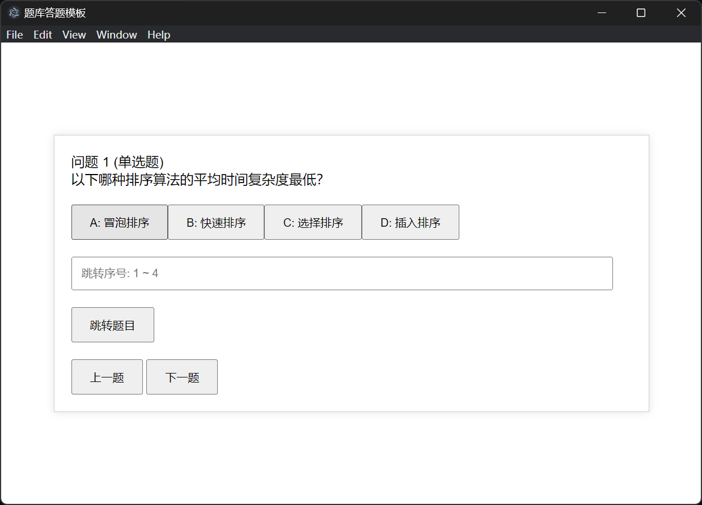
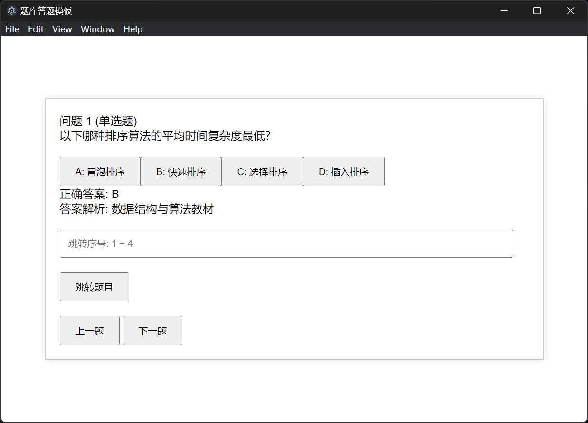
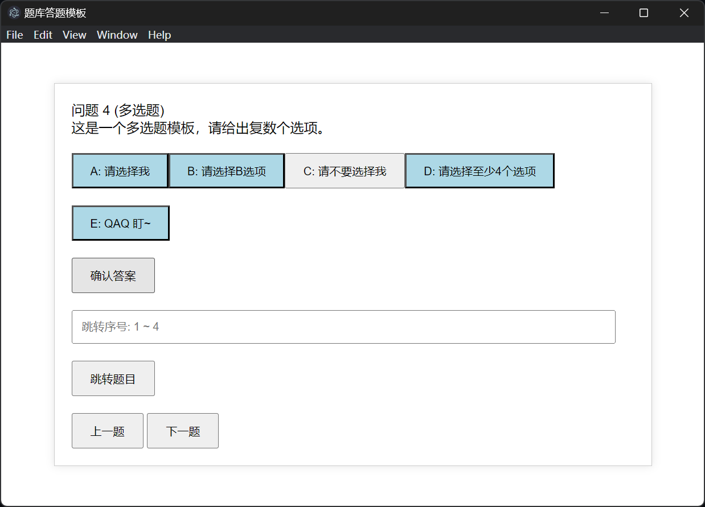
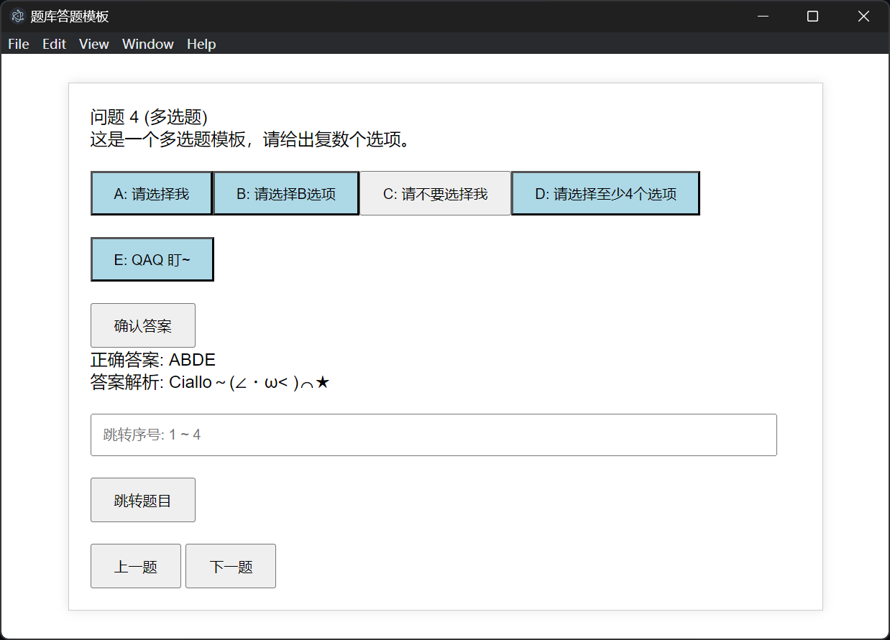

# quiz-app
A quiz app template framework built on the front-end  
一个基于前端构建的答题测验APP模板框架  

## 源代码介绍
对于原始获得的题目信息，有关格式我们在`questions.txt`中已经给出。  
一个题目需要包含以数字序号开始的题干信息，以字母序号开始的选项信息，参考答案以及出处。在每道题目之前使用空行隔开。  
  
我们可以使用`text2json.py`，将原始题目信息自动转化为json格式题目信息。使用者亦可根据实际情况，直接写出json格式题目信息。  
对于json格式题目信息，有关格式我们在`questions.json`中给出。其中，需要包含有`question` `options` `answer` `explanation` `answer_num`字段信息。  

当构建桌面端或移动端APP时，请将有关代码套用[Electron](https://www.electronjs.org/)或[Cordova](https://cordova.apache.org/)框架。你也可以通过[我的博客](https://wangquanlikun.github.io/2024/03/11/Electron-app-build/)获取有关教程。  

## 运行展示
系统可以根据`answer_num`字段信息判定，自动套用单选题与多选题逻辑。  
对于单选题，在点击选项后即得出答案  
  
  
  
  
对于多选题，在点击选项后会得到选项的标记信息，再次点击可以取消选择。需要手动点击确认答案后，即得出答案  
  
  
  
  
同时，本程序可以支持自动跳转上一次完成到的题目，便于快速开始测验与衔接练习  
  
~其它更新功能也正在开发中~  
- [ ] 识别正确与错误答案
- [ ] 记录错误信息，错题强化
  
